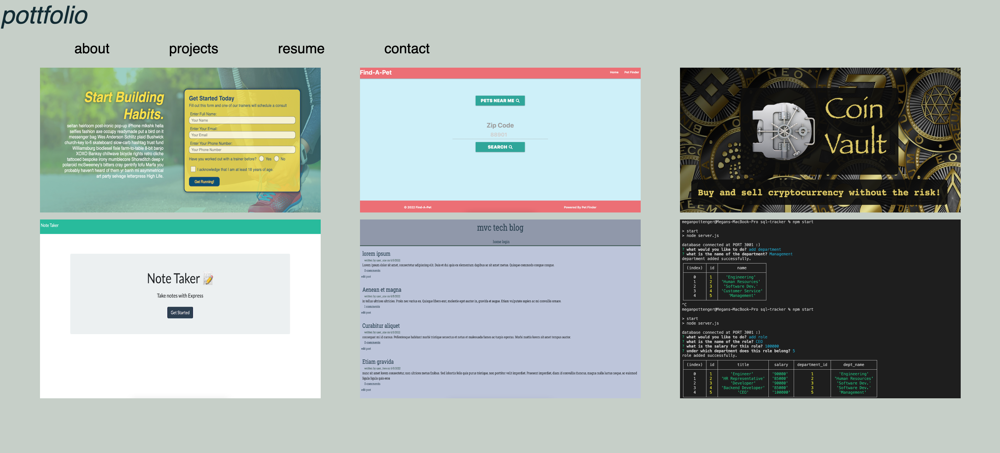

# React portfolio

## Table of Contents
### -[Links](#links)
### -[Installation](#installation)
### -[Technologies](#technologies)
### -[Questions](#questions)

## Links
A screenshot of the final project:

## Description
Our challenge this week was to create a single page application (SPA) using React. Here, we were able to showcase the culmination of our skills and learn more about React at the same time! By utilizing React's components, you can click on the links in the nav bar, which will render that specific component, and you never leave the page. This is an awesome way to optimize the user's experience, and makes total sense for sites that scale up exponentially.

## Installation
### Instructions for Project Installation:
Run 'npm i' to ensure all packages are installed correctly.

## Technologies
### Built With:
React, Javascript.

## Questions
### Please reach out with any questions or concerns!
Github: https://github.com/mtpott

Email: mtpott23@gmail.com